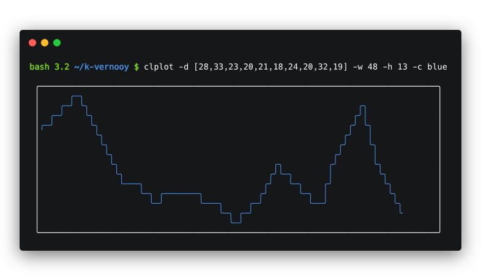

# clplot
An ascii chart generator for the terminal written in C++.

  

## Installation

### Git install:
```bash
git clone https://github.com/k-vernooy/clplot
make
make install
```
### Brew install:

Coming soon...

## Usage
<b>clplot</b> comes with many options for style, customization, and chart types.
### Options:

 The below chart has basic information about command line options that can be passed to clplot. For full documentation on flags, see the [documentation site](https://k-vernooy.github.io/projects/clplot).  
   
| Flag        | Description           | Example  |
| ------------- |-------------| -----|
| -d |  Specify data for the chart, in format `[num1, num2, numN]`   | `-d [1,5.1,3,4]`
| -t |  Specify the chart type (line, bar) | `-t bar`
| -h | Change the height of the chart (in lines) |  `-h 14`
-w | Change the width of the chart (in columns) |  `-w 20`
-p | Specify the coordinateg for the top left corner of the chart. |  `-p 5,6`
-s | Sparkline charts - remove all labels |  `-s`


## See also

- [fast](github.com/k-vernooy/fast): an implementation of cplot that monitors internet speed.
- [stonks](github.com/k-vernooy/stonks): a stock monitoring terminal app that uses clplot to give graphs.
- [k-vernooy.github.io/projects/clplot](https://k-vernooy.github.io/projects/clplot) - a page with full documentation and example usages and quick projects for clplot.

## Compatibility

As of now, only tested on macOS - should work on linux as well.
